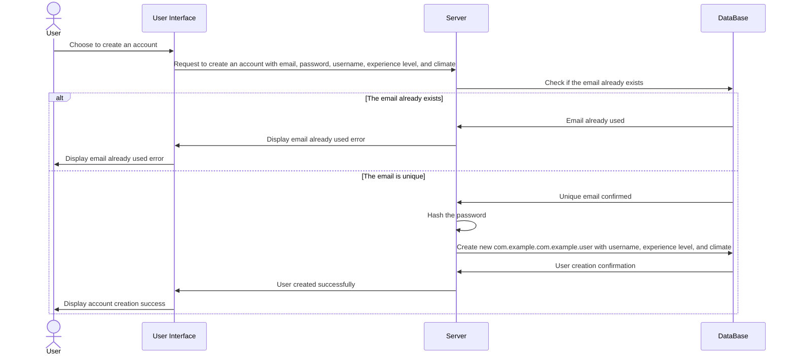

```mermaid
sequenceDiagram
    actor U as User
    participant UI as User Interface
    participant S as Server
    participant DB as DataBase

    U->>UI: Choose to create an account
    UI->>S: Request to create an account with email, password, username, experience level, and climate
    S->>DB: Check if the email already exists
    alt The email already exists
        DB->>S: Email already used
        S->>UI: Display email already used error
        UI->>U: Display email already used error
    else The email is unique
        DB->>S: Unique email confirmed
        S->>S: Hash the password
        S->>DB: Create new com.example.com.example.user with username, experience level, and climate
        DB->>S: User creation confirmation
        S->>UI: User created successfully
        UI->>U: Display account creation success
    end
```