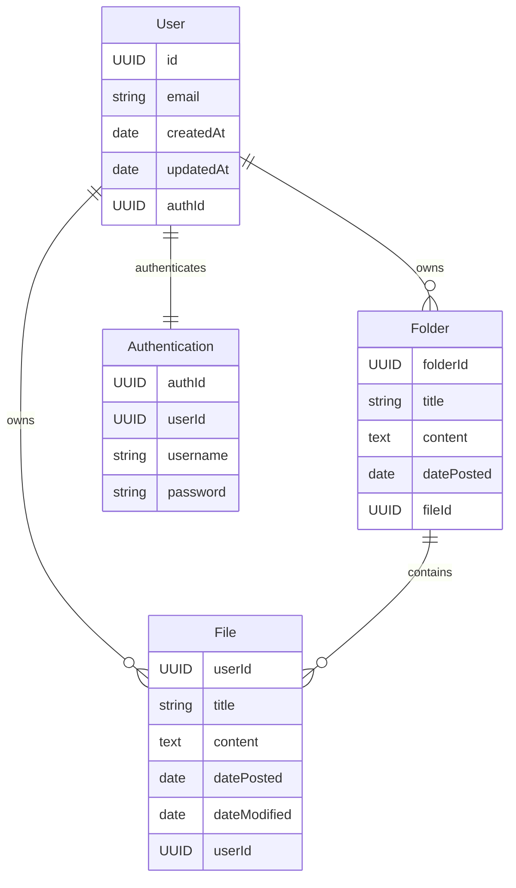

```mermaid
erDiagram
User ||--o{ File : owns
User ||--o{ Folder : owns
User ||--|| Authentication : authenticates
Folder ||--o{ File : contains


User {
UUID id
string email
date createdAt
date updatedAt
UUID authId
}

Authentication {
UUID authId
UUID userId
string username 
string password
}

File {
UUID userId
string title
text content
date datePosted
date dateModified
UUID userId
} 

Folder {
UUID folderId
string title
text content
date datePosted 
UUID fileId
}
```
  

