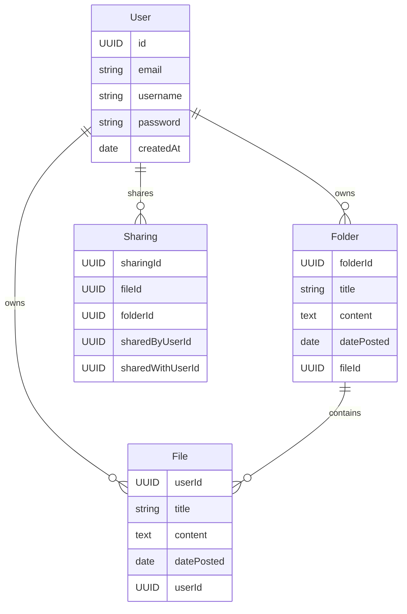

```mermaid
erDiagram
User ||--o{ File : owns
User ||--o{ Folder : owns
Folder ||--o{ File : contains
User ||--o{ Sharing : shares

User {
UUID id
string email
string username
string password
date createdAt
}

File {
UUID userId
string title
text content
date datePosted
UUID userId
}

Folder {
UUID folderId
string title
text content
date datePosted
UUID fileId
}

Sharing {
UUID sharingId
UUID fileId
UUID folderId
UUID sharedByUserId
UUID sharedWithUserId
}
```